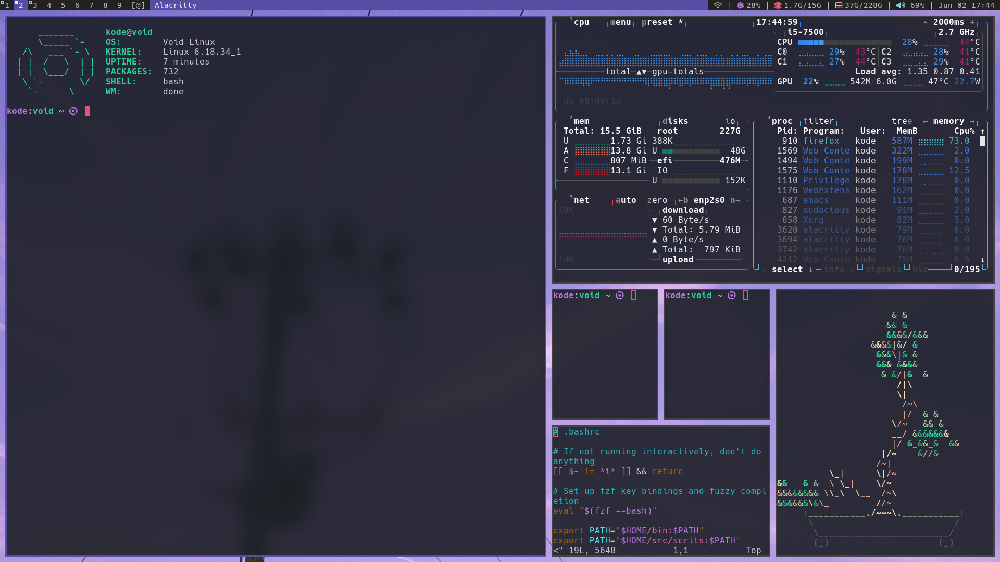
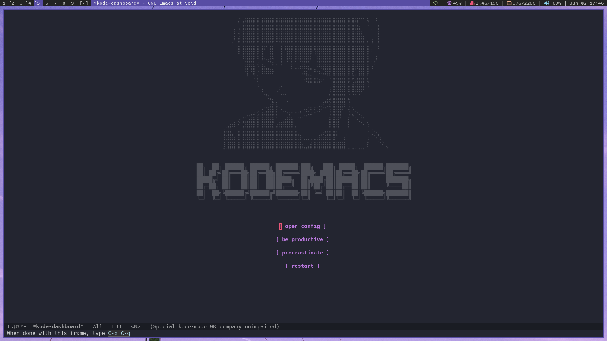
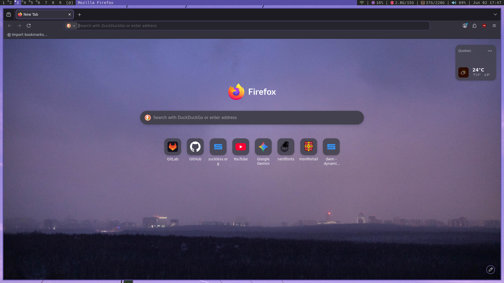
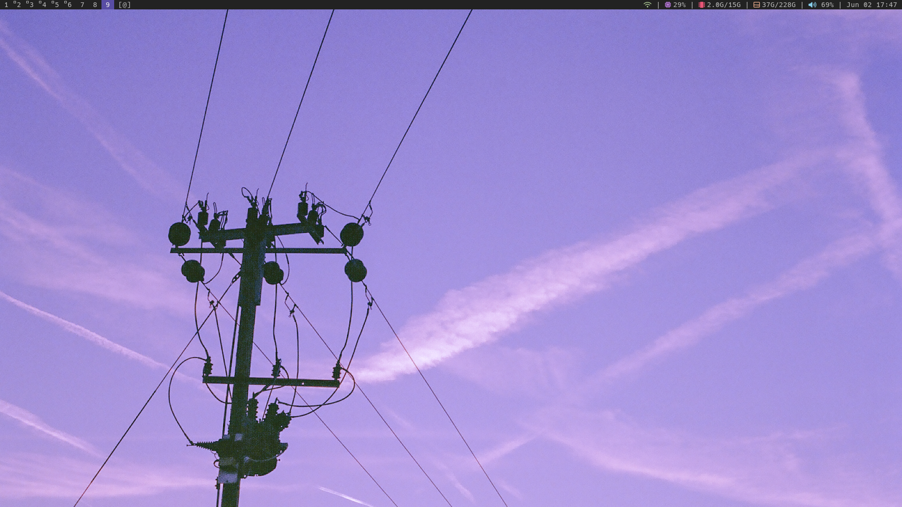

# My Void Linux config

My Alacritty theme can be found [here](https://github.com/kode-tar-gz/horizon.toml), and my Emacs configuration also has [its own repo](https://github.com/kode-tar-gz/.emacs.d).
The `instructions.md` file may be helpful for anyone trying to use my config, although I know there's still a good bit of information missing. If I ever have the time, I'll make better documentation so anyone can follow along.
